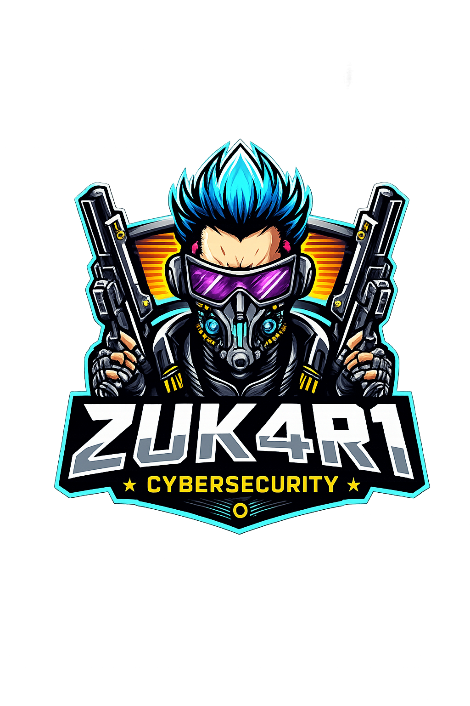

  

---

## 🔎 Acerca de mí
- 🧑‍💻 Profesional en formación en ciberseguridad y hacking ético.  
- ⚙️ Especializado en pentesting web, explotación de vulnerabilidades y automatización ofensiva.  
- 🚀 Desarrollador de herramientas enfocadas en auditorías de seguridad y bug bounty.  
- 🛡️ Certificado en eJPT (eLearnSecurity Junior Penetration Tester).  
- 🎯 Actualmente avanzando hacia certificaciones de nivel profesional como OSCP.

---

## 📚 Actualmente estoy
- 💥 Practicando laboratorios avanzados en plataformas de pentesting y entornos controlados.  
- 🧠 Profundizando en explotación web, Active Directory, evasión y post-explotación.  
- 🧰 Construyendo herramientas para automatización ofensiva, análisis y bug bounty.  
- 🔍 Mejorando habilidades en reconocimiento, enumeración y explotación avanzada.

---

## 🧰 Lenguajes y herramientas

  
  
  
  

---

## 🚀 Proyectos destacados

- **CSRFreakX** — Es una herramienta ofensiva avanzada para detectar, generar y explotar vulnerabilidades CSRF
- **CloudGhost** — Permite identificar posibles filtraciones de la IP real en servidores protegidos por Cloudflare.
- **lethal** — Herramienta ofensiva avanzada para la explotación automatizada de vulnerabilidades IDOR y CSRF

## 🏅 Certificaciones & Formación
- **CEH** — Certified Ethical Hacker (completada).
- **Web Application Pentesting** - (completada).
- **Offensive Pentesting** - (completada).
- **eJPT** — Practical Penetration Testing (completada).  
- **CWSE** — Web Security Certification (en curso).
---

## ☕ Apoya mis proyectos
Si te resultan útiles mis herramientas, considera dar una ⭐ en GitHub o invitarme un café. ¡Gracias!

  

---

  Hecho con ❤️ | Enfocado en aprendizaje responsable y pruebas en entornos controlados.

